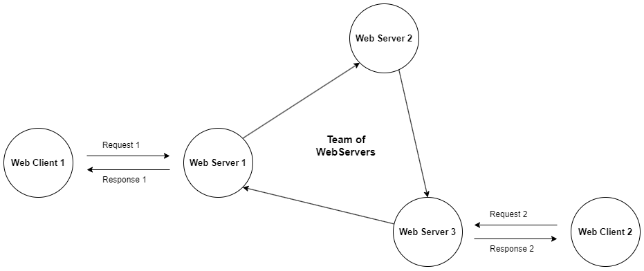

# Distributed WebServers



## About

Τhis project was created for the purposes of a university course. It represents an abstract creation of a circular list of web servers that communicate with each other and respond/forward client requests.

## Setup

- **Linux Ubuntu**

    ```bash
    sudo apt install python3
    sudo apt install python3-pip
    pip install -r requirements.txt
    ```

## Usage

In this program we are using the localhost IPv4 andress `127.0.1.1` and all the ip-port comparisons and storage are based on the different **port** numbers.

### Servers communication example

- Run the first server (lets call it ***WS1***):

    ```bash
    python3 src/WebServer.py
    ```

    - By default, each server during its initialization phase is configured to listen on port `4043`. Once the first server is '*online*', the next server being added to the circular list will find the next available **listening port**. This occurs because we run the examples on the same machine using the localhost address as the listening IP.

    - **Servers List**: `127.0.1.1:4043(WS1)`

- Run a second server (***WS2***) on a new terminal by appending to the previous one in the list:

    ```bash
    python3 src/WebServer.py --prev-ip 127.0.1.1 --prev-port 4043
    ```

  - Every server in the list maintains its own copy of the circular list with the latest status of all connected servers.

  - After the insertion the ***WS1*** server updates it's own list of connected servers and then a **CHECK** message is sent to the next server in the list by checking connectivity. In this example, the next server is the new one ***WS2***. This new server will 'catch' the **CHECK** message and forward it to the next one in the list. The cicrular message will stop after reached the '***creator***' server (the one that originally sent the **CHECK** message). If any server does not respond to the **CHECK** message then it will be deleted from the list maintained by the previous server and the circular message will continue to the next (from the one that has been deleted) available active server.

    - **Note**: The **CHECK** message enables each server to update its copy of the circular list with the latest status of all connected servers.

  - **Servers List**: `127.0.1.1:<WS1_PORT>(WS1) -> 127.0.1.1:<WS2_PORT>(WS2) -> (WS1)`

### Clients requests examples

- If any client request cannot processed by a server it is forwarded to the next one in the list by starting a circular **FORWARD** message updating the requested item in each server's database.

- **GET** request:
  
    ```bash
    python3 src/WebClient.py -get index.html -i 127.0.1.1 -p <WS_PORT>
    ```

    - During the initial run, none of the connected servers will have any files in their 'database'. In our program, the database is simulated using a simple dictionary object that contains file names and their plaintext content.
    - To test the GET request, we must first run a PUT request to update the server with the desired file (the server will then forward the changes to the others on the list).

- **PUT** request:
  
    ```bash
    python3 src/WebClient.py -put test_files/index.html -i 127.0.1.1 -p <WS_PORT>
    ```

## Useful Commands

- Show processes running Python:

    ```bash
    ps axu | grep python
    ```

- Show open connections on specific port:

    ```bash
    netstat -ano | grep <PORT>
    ```
